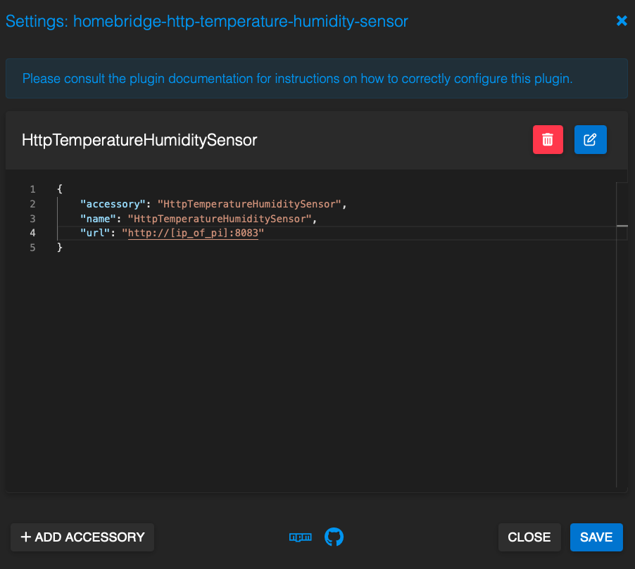

# Raspberry Pi Temperature Sensor
This python application runs a flask server to serve to a homebridge
http temperature humidity sensor plugin so that I can monitor the
temperature of my house from apple homekit and it's all local.

## resources used
http://raspberrypi.stackexchange.com/questions/121963/raspberry-pi-dht-11-sensor-not-working-i-get-none-none

## homebridge plugin used
https://github.com/UnPoilTefal/homebridge-advanced-http-temperature-humidity#readme

## homebridge plugin configuration

